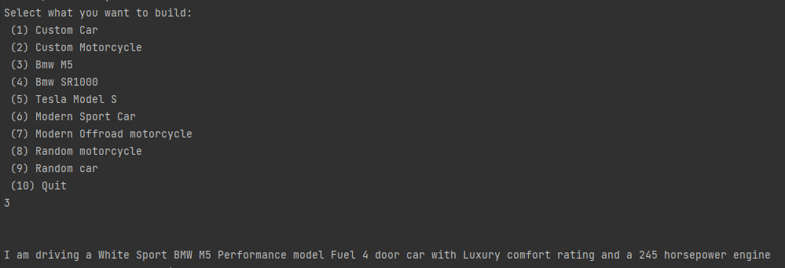
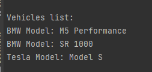
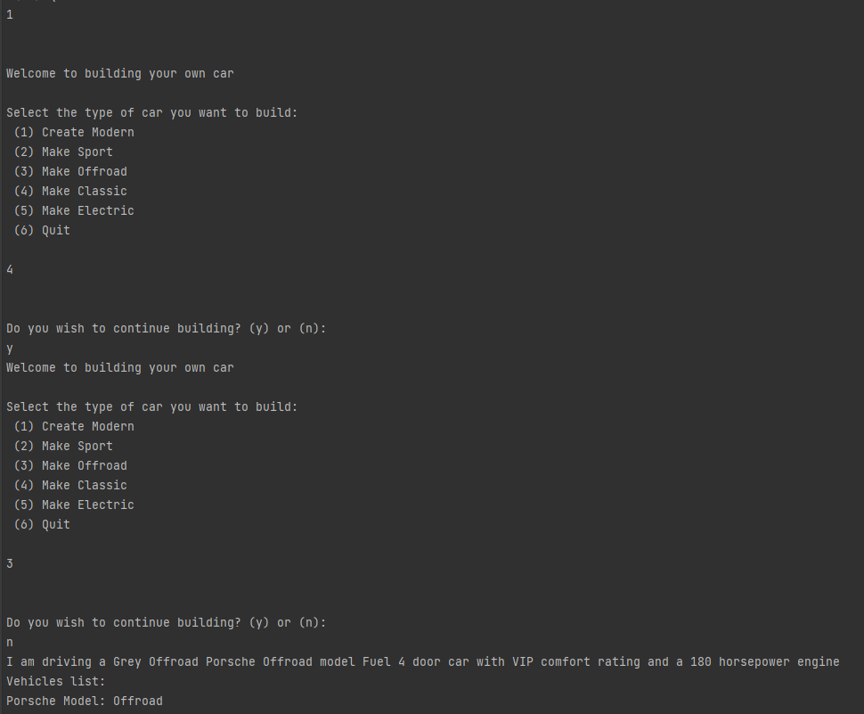
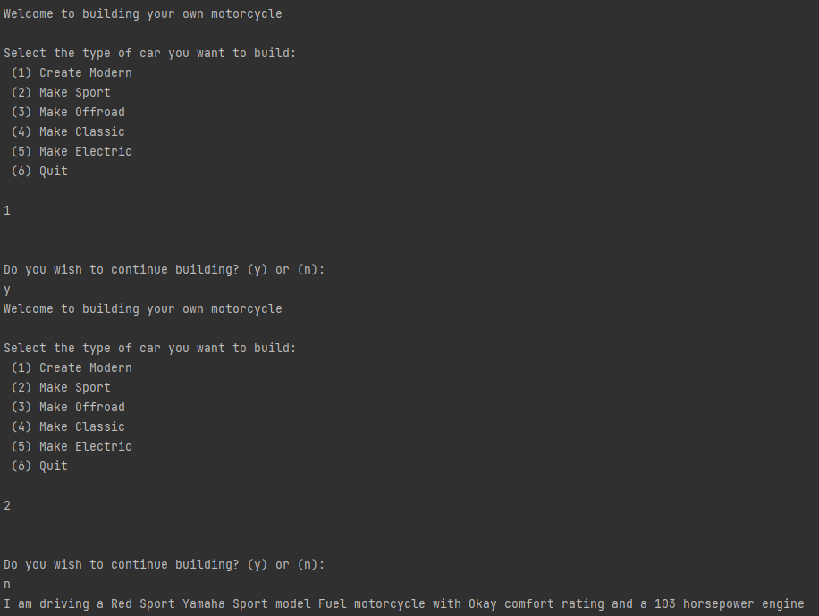

# Creational design patterns laboratory

#### Author: George Vragalev

## Theory
In software engineering, the creational design patterns are the general solutions that deal with object creation, trying to create objects in a manner suitable to the situation. The basic form of object creation could result in design problems or added complexity to the design. Creational design patterns solve this problem by optimizing, hiding or controlling the object creation.

Some examples of this kind of design patterns are:

* Singleton
* Builder
* Prototype
* Object Pooling
* Factory Method
* Abstract Factory

## Objectives

1. Study and understand the Creational Design Patterns.

2. Choose a domain, define its main classes/models/entities and choose the appropriate instantiation mechanisms.

3. Use some creational design patterns for object instantiation in a sample project.

## Implementation

In this laboratory I implemented 5 creational design patterns:

* Singleton
* Builder
* Prototype
* Factory Method
* Abstract Factory

This is a console application of a vehicle factory that lets you create different types of 
vehicles until you want to quit the app. 

When you run you will be provided with several options:

After you select one and after you have finished customizing your vehicle you will be able to drive it and
see the specs of your newly built machine.
You can also choose from some of the already pre-built options like that Tesla, Bmw M5, a Bmw SR1000 motorcycle.
The factories allow you to create any type of land vehicle. 

The way the implementation goes is that it allows 
to expand the vehicle factory by also creating for the future a retro vehicle dealership that allows you to build retro cars
just like the modernVehicleFactory does.

After each time you create a vehicle it will be added to a singleton instance of a vehicles list.

You can build custom vehicles by setting their type from the first 2 available options or build preexisting 
vehicle templates and customize them as well:

You can make various combinations of the type of vehicle that you will create

### Prototype

The Vehicle model class has an abstract method called clone that lets you create 
an exact copy of any vehicle. This is really useful in a vehicle factory because 
vehicles need to be produced at a fast rate and the only thing that would differ is 
the VIN code for the car, other than that the clone method for a vehicle can multiply 
the vehicle quantity just like in a real factory.

### Singleton

The singleton implementation is done in the Vehicles class which contains a single 
instance of a vehicles list. The first call to list will initialize the list using a private 
constructor, however further calls to getting the list will return the already initialized 
object.

### Factory method

With VehicleFactory I have a class that can create any type of land vehicle. 
This is demonstated the way I have a Factory for Cars and Motorcycles.

The vehicle class has common shared properties and an abstract method Drive that lets you drive 
drive the vehicle and demonstrate the type.

The VehicleFactory is inherited by Car and Motorcycle factory that produce the 
corresponding vehicles using the abstract build method.

### Abstract Factory

After creating the CarFactory I used it to create a specific version of a car.
There are different types of cars: modern, retro, sport etc.

I created a modern factory interface IModernFactory that allows the inheritor to build
modern versions of vehicles. For example a modern car can be electric while a retro car can't 
in simple terms.
The same goes for ModernMotorcycleFactory.

### Builder

Using the interface IVehicleBuilder I am able to set the specifc characteristics of a vehicle. 
In order to build a vehicle you have to SetEngine SetStyle and SetModel of 
your vehicle. 

Another interface IVehicleFactory has methods that can make your vehicle a specific type
like sport, offroad etc.

By using the IVehicleBuilder you can create your own vehicle and then call one of the 
IVehicleFactory methods to complete your vehicle by setting the base characteristics for your preferred 
vehicle type. 

This is demonstrated in the BMW builder which inherits from ModernFactories.

To replicate a real BMW dealership, I created a BMW car builder that lets you
create and build your own bmw car or build an existing M5 model, and a 
BMW motorcycle builder that also lets you customize your own BMW motorcycle or 
build a preexisting SR1000 BMW model.

The BMW interface builder inherits methods from IVehicleBuilder so that you can
fully customize your vehicle from the style down to the engine.

Another instance of such a dealership is the TeslaBuilder class that has it's own
ITeslaBuilder interface that has specific data for the Tesla. The TeslaCarBuilder
itself lets you customize your own Tesla car and let's you build a Tesla Model S.