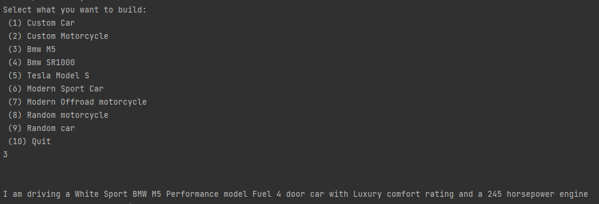
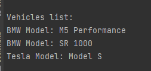
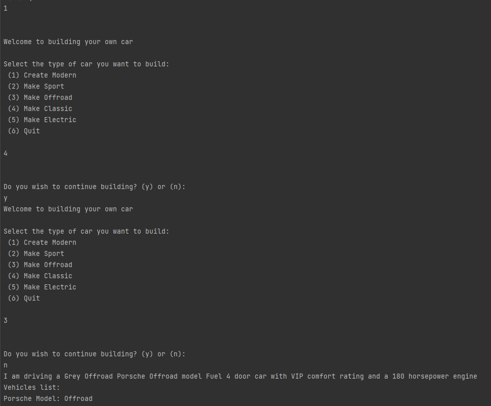
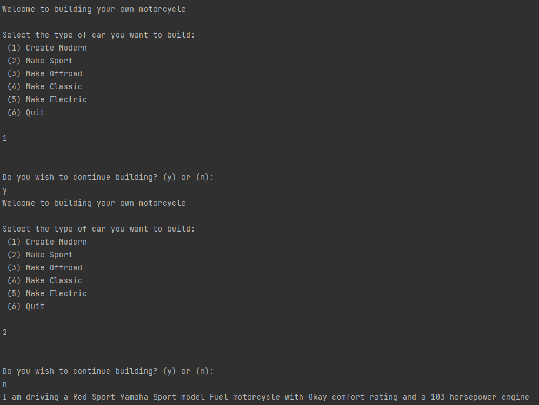

# Creational design patterns laboratory

#### Author: George Vragalev

## Theory
In software engineering, the creational design patterns are the general solutions that deal with object creation, trying to create objects in a manner suitable to the situation. The basic form of object creation could result in design problems or added complexity to the design. Creational design patterns solve this problem by optimizing, hiding or controlling the object creation.

Some examples of this kind of design patterns are:

* Singleton
* Builder
* Prototype
* Object Pooling
* Factory Method
* Abstract Factory

## Objectives

1. Study and understand the Creational Design Patterns.

2. Choose a domain, define its main classes/models/entities and choose the appropriate instantiation mechanisms.

3. Use some creational design patterns for object instantiation in a sample project.

## Implementation

In this laboratory I implemented 5 creational design patterns:

* Singleton
* Builder
* Prototype
* Factory Method
* Abstract Factory

This is a console application of a vehicle factory that lets you create different types of 
vehicles until you want to quit the app. 

When you run you will be provided with several options:

After you select one and after you have finished customizing your vehicle you will be able to drive it and
see the specs of your newly built machine.
You can also choose from some of the already pre-built options like that Tesla, Bmw M5, a Bmw SR1000 motorcycle.
The factories allow you to create any type of land vehicle. 

The way the implementation goes is that it allows 
to expand the vehicle factory by also creating for the future a retro vehicle dealership that allows you to build retro cars
just like the modernVehicleFactory does.

After each time you create a vehicle it will be added to a singleton instance of a vehicles list.

You can build custom vehicles by setting their type from the first 2 available options:

You can make various combinations of the type of vehicle that you will create

